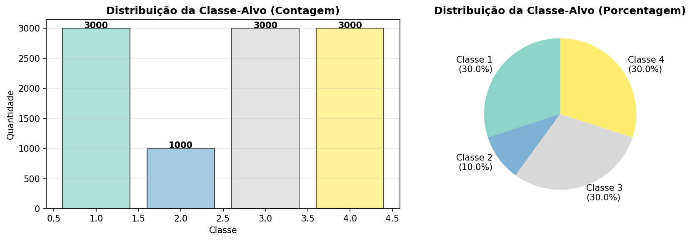
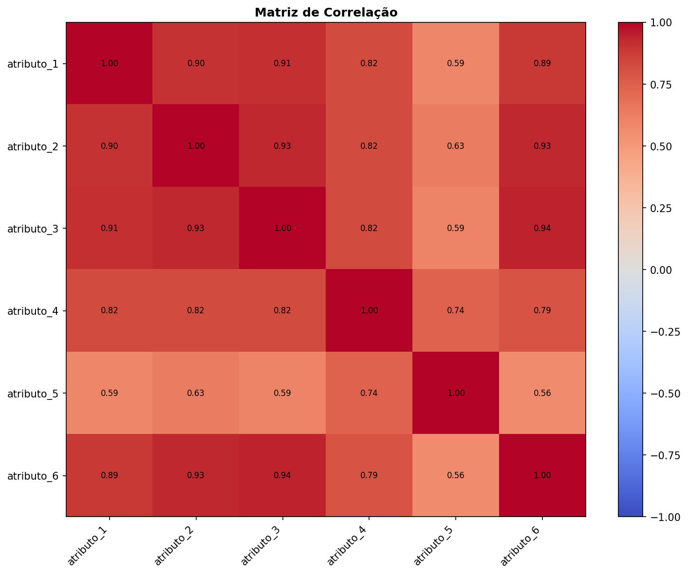
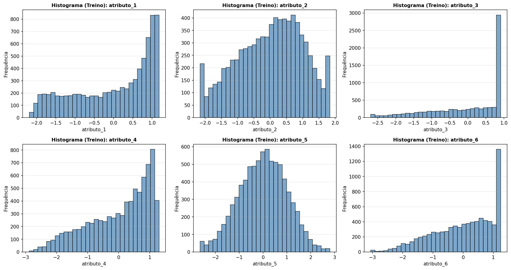

<p align="center"> 
  
</p>

<h1 align="center">
Agrupamento e Sistemas Fuzzy
</h1>

<h3 align="center">
Desenvolvimento de um sistema fuzzy baseado em Mamdani — regras derivadas por agrupamento (K‑Means).
</h3>

<div align="center">


</div>

---

<div align="justify">
<p><strong>Disciplina:</strong> Inteligência Computacional<br>
<strong>Instituição:</strong> Centro Federal de Educação Tecnológica de Minas Gerais (CEFET-MG) - Campus V Divinópolis<br>
<strong>Professor:</strong> Alisson Marques da Silva<br>
<strong>Projeto:</strong> "Trabalho Intermediário"<br>
<strong>Alunos:</strong> João Pedro Rodrigues Silva e Samuel Silva Gomes<br>
</div>


## Visão geral

O fluxo do projeto foi montado para que antes de criar-se as regras fuzzy, entende-se a base, corrigindo-se inconsistências e transformar-se os dados em grupos com comportamento parecido. Cada regra foi derivada de um grupo real encontrado nos dados. Assim, o processo segue esta lógica:
1) **Análise exploratória** para entender a distribuição dos dados.
2) **Preprocessamento** para deixar a base pronta para modelagem.
3) **Agrupamento K-Means** para separar padrões semelhantes.
4) **Geração de regras fuzzy Mamdani** a partir dos clusters obtidos.

## Análise exploratória

A análise exploratória foi feita sobre a base original disponibilizada, antes de qualquer transformação, evitando-se que decisões sejam tomadas com base em uma base já alterada. Ademais, o que foi-se observado quantidade de registros e atributos da base, distribuição da classe-alvo para verificar desbalanceamento valores ausentes para identificar necessidade de imputação, outliers para medir a presença de valores extremos e correlação entre atributos numéricos para enxergar relações lineares.

### Imagens da análise exploratória

<p>
	
	
</p>

<p>
	
</p>

Tal medida foi executada para entender a estrutura da base antes de modelar, detectar problemas de qualidade como ausentes e outliers, evitar suposições errada sobre número de classes ou comportamento dos atributos e guiar o preprocessamento com base em evidência real.

## Medidas tomadas no preprocessamento

O preprocessamento foi feito para deixar a base pronta para o agrupamento sem vazar informação do teste para o treino.

1) **Divisão treino/teste logo no início**.
2) **Imputação de faltantes** usando apenas a média do treino.
3) **Tratamento de outliers** com limites IQR calculados no treino.
4) **Normalização Z-score** com média e desvio padrão do treino.
5) **Salvamento dos parâmetros** em JSON para caso de reuso futuro.

Tais medidas foram adotadas visando evitar vazamento de dados pois os parâmetros não podem vir do conjunto de teste, garantir consistência entre treino e novos dados, padronizar a escala para que o agrupamento não seja dominado por atributos com valores maiores e reduzir impacto de ruído causado por faltantes e extremos.

## Método de agrupamento usado

Foi usado **K-Means** como método de agrupamento. Pois é **simples**, direto e fácil de interpretar, funciona bem quando os dados já estão **normalizados**, produz **centróides**, que são úteis para representar padrões e depois transformar em regras e é uma boa escolha quando o objetivo é criar uma base inicial de regras fuzzy de forma clara e rastreável. Implementou-se desta maneira:
1) A base de treino preprocessada foi carregada de `data/database_treino.csv`.
2) As colunas de atributos foram separadas da classe.
3) O K-Means foi executado com **4 clusters**.
4) Cada registro recebeu um rótulo de cluster.
5) Foram salvos:
	- `output/tables/cluster_centers.csv`
	- `output/tables/clustering_params.json`
	- `output/plots/distribuicao_clusters.png`

O algoritmo separou a base em grupos com perfis distintos. Esses grupos serviram como uma forma organizada de resumir os padrões presentes nos dados. Ao invés de usar um modelo TSK, optamos por **Mamdani** porque o objetivo principal aqui é
gerar regras fuzzy mais diretas e fáceis de interpretar. Como a base já está normalizada e todas as variáveis são numéricas, isso permite usar funções de pertinência gaussianas nos antecedentes e consequentes associados diretamente às classes.

### Por que Mamdani

- As regras ficam mais próximas da forma clássica de um sistema fuzzy textual.
- Cada cluster gera uma regra com antecedente baseado no centróide e consequente na classe majoritária.
- Isso facilita a explicação do sistema para fins acadêmicos e de relatório.

1) Usamos o K‑Means para identificar regiões homogêneas (cada cluster → uma regra).
2) Para cada regra, definimos MFs gaussianas por atributo: centro = valor no centróide, sigma = desvio padrão dentro do cluster (com fallback para o desvio global).
3) Calculamos o grau de ativação da regra com operador `min` nos antecedentes.
4) A consequente de cada regra é a classe majoritária observada no cluster.
5) Na inferência, agregamos as ativações por classe e escolhemos a classe com maior suporte.

Dentre as vantagens adotadas tem-se o mantimento da rastreabilidade de cada regra corresponde a uma região encontrada nos dados, o sistema fica mais fácil de explicar e de apresentar-se e por fim a inferência é rápida e diretamente ligada aos clusters obtidos.

### Suporte e confiabilidade

No contexto das regras Mamdani, usamos duas medidas para interpretar cada cluster/regra:

- **Suporte**: quantidade de registros que caíram naquele cluster. Em outras palavras, indica o tamanho da região representada pela regra.
- **Confiabilidade**: proporção da classe majoritária dentro do cluster.
	$$confiabilidade = \frac{\text{quantidade da classe majoritária}}{\text{total de registros do cluster}}$$

No projeto, essas duas métricas ajudam a julgar se uma regra realmente vale a pena para compor o sistema fuzzy. O treinamento Mamdani salva um modelo (JSON e pickle) contendo:

- `output/tables/mamdani_model.json`: estrutura com centróides, sigmas e regras.

## Arquivos gerados

- `data/database_treino.csv`: base de treino preprocessada.
- `data/database_teste.csv`: base de teste preprocessada.
- `output/tables/preprocessing_params.json`: parâmetros do preprocessamento.
- `output/tables/cluster_centers.csv`: centróides dos clusters.
- `output/tables/clustering_params.json`: parâmetros do K-Means.
- `output/tables/mamdani_model.json`: modelo Mamdani com regras e parâmetros.

## Execução

Para gerar o preprocessamento e os agrupamentos:

```bash
python3 src/data.py
python3 src/fuzzy.py
```


